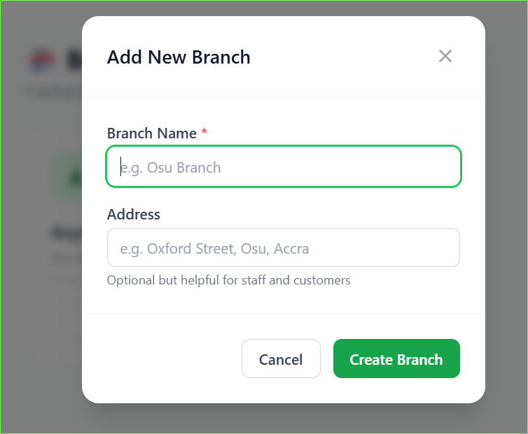

# Branches

Each branch is a physical restaurant location. You can manage multiple branches from one account.

## Add a branch

1. Go to **Branches** in the sidebar
2. Click **Add Branch**
3. Enter:
   - **Branch name** (e.g. Osu Branch)
   - **Address** (optional)
4. Click **Save**

> Your billing countdown starts when you create your first branch.

---

## Branch detail

Click on any branch to open its detail page. It has four tabs:

| Tab | What it contains |
|---|---|
| **Tables** | All tables and their QR codes |
| **Staff** | Staff assigned to this branch |
| **Inventory** | Which items are available at this branch |
| **Orders** | Recent orders at this branch |

---

## Delete a branch

Branches are never permanently deleted. They are soft-deleted which means:

- The branch is hidden from customers immediately
- Order history is preserved
- Staff assignments are kept

To delete a branch:
1. Open the branch
2. Click **Delete Branch**
3. Confirm

> You cannot delete a branch that has active orders (pending or preparing).

---

## Multiple branches

Each branch has its own:
- Tables and QR codes
- Staff assignments
- Inventory and pricing
- Order history

Menu categories and products are shared across all branches.