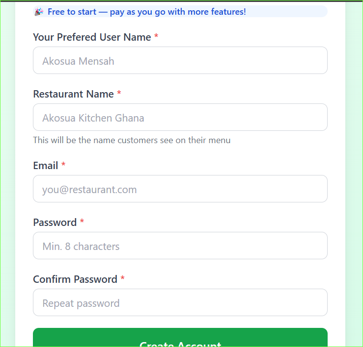
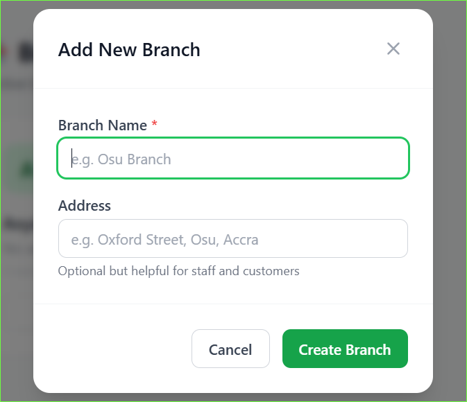
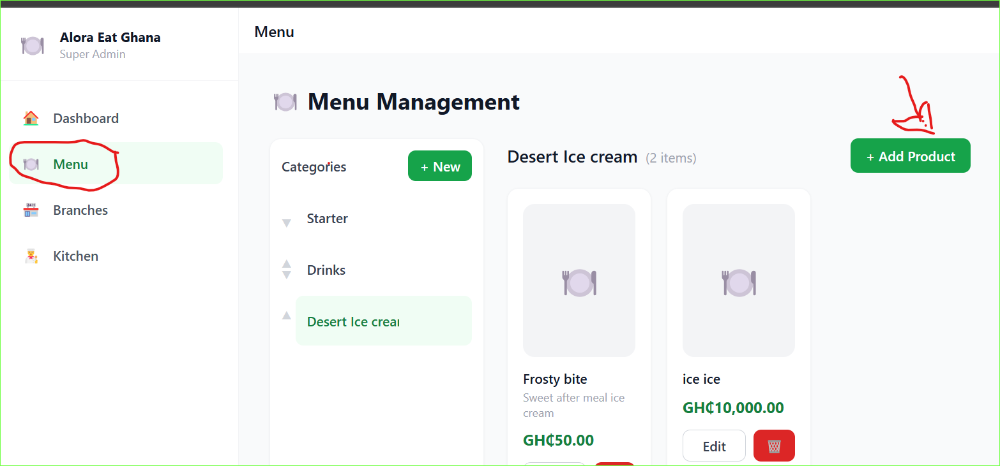
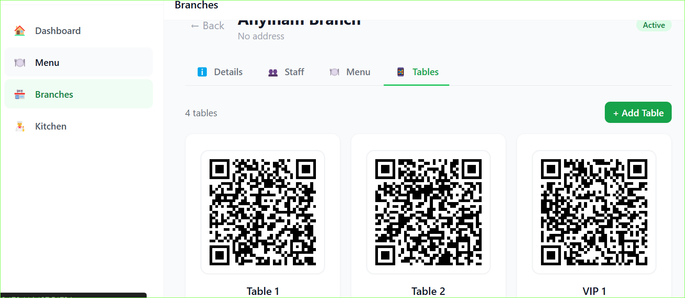
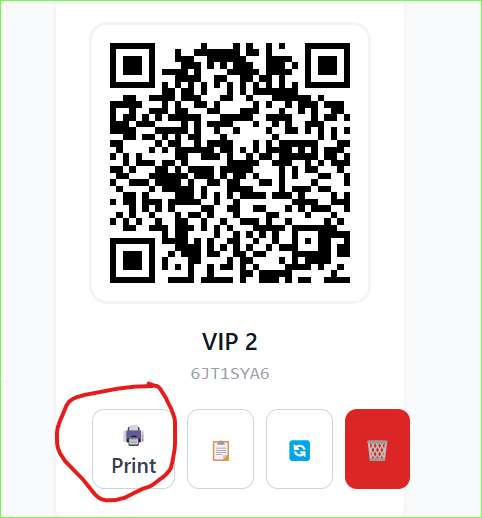

# Getting Started

Welcome to Alora Eat. This guide will get your restaurant up and running in minutes.

## Step 1 — Create your account

1. Go to [v1.aloraeat.xyz](https://v1.aloraeat.xyz)
2. Click **Sign Up**
3. Enter your name, restaurant name, email and password
4. Click **Create Account**

> Your restaurant name must be unique. If the name is already taken you will see an error.

---

## Step 2 — Create your first branch

After signing in you will land on the Dashboard.

1. Go to **Branches** in the sidebar
2. Click **Add Branch**
3. Enter the branch name and address
4. Click **Save**

> Your billing countdown starts when you create your first branch.

---

## Step 3 — Add your menu

1. Go to **Menu Management** in the sidebar
2. Click **Add Category** (e.g. Starters, Mains, Drinks)
3. Inside each category click **Add Product**
4. Enter name, description, price and an optional image
5. Click **Save**

---

## Step 4 — Set up your tables

1. Go to **Branches** and open your branch
2. Click the **Tables** tab
3. Click **Add Table**
4. Enter the table name (e.g. Table 1, VIP Booth)
5. Click **Save**

Each table gets a unique QR code automatically.

---

## Step 5 — Print your QR codes

1. On the Tables tab click **Print QR** next to any table
2. A print dialog opens with the QR code ready
3. Print and place it on the table

Customers scan the QR code and go straight to your menu.

---

## Step 6 — Add your staff

1. Go to **Branches** and open your branch
2. Click the **Staff** tab
3. Click **Add Staff**
4. Enter their name, email, password and role
5. Click **Create**

They can now log in and access their assigned features.

---

## You are ready

Your restaurant is set up. Share the QR codes with your tables and your team is ready to go.

**Next steps:**
- [How QR ordering works →](/qr-ordering)
- [How the kitchen board works →](/kitchen-board)
- [Managing your inventory →](/inventory)