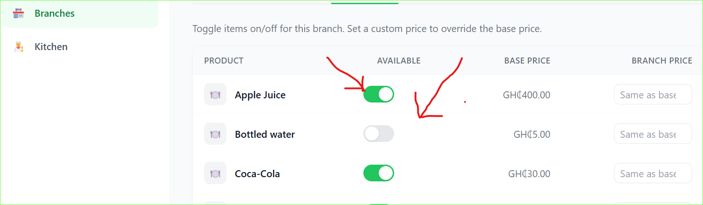
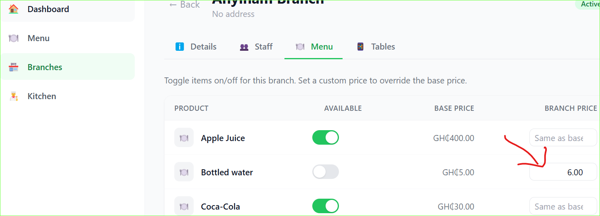

# Inventory

Control which menu items are available at each branch and set branch-specific prices.

## How inventory works

Every product you add to your menu is automatically added to every branch with **availability off** by default.

You must manually turn on each item per branch.

---

## Turn an item on or off

1. Go to **Branches** and open a branch
2. Click the **Menu** tab
3. Find the product
4. Toggle the switch to turn it on or off

When an item is turned off it disappears from the customer menu at that branch immediately.

---

## Set a branch price

You can override the base price for a specific branch.

1. On the Inventory tab find the product
2. Click the price field next to it
3. Enter the branch-specific price
4. Click **Save**

If no override is set the base price from Menu Management is used.

---

## Who can manage inventory

| Role | Can manage inventory |
|---|---|
| Super Admin | ✅ All branches |
| Manager | ✅ All branches |
| Branch Manager | ✅ Their branch only |
| Kitchen / Waiter | ❌ No |