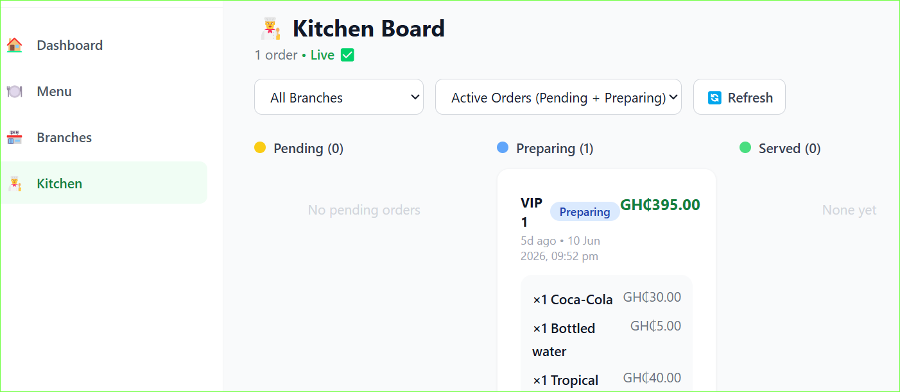
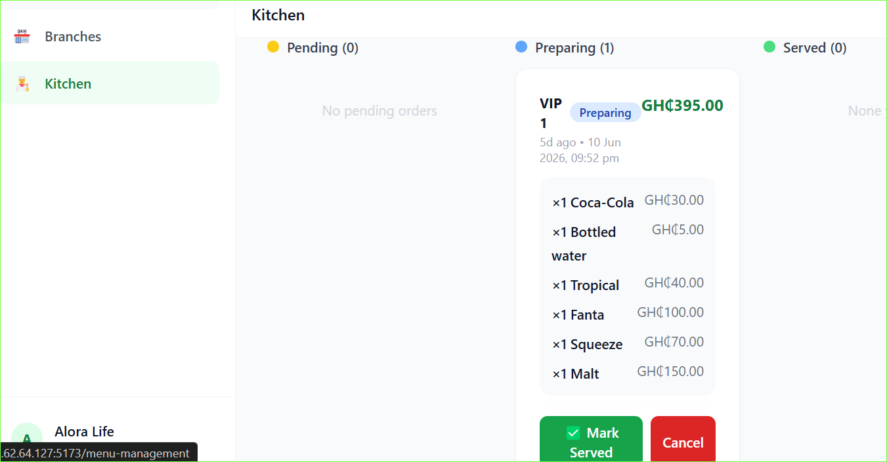

# Kitchen Board

The kitchen board shows all incoming orders in real time. No refreshing needed.

## Accessing the kitchen board

1. Log in as a **kitchen** staff member
2. You are taken to the Kitchen page automatically

---

## How orders appear

When a customer places an order it appears on the kitchen board instantly.

Each order card shows:
- Table name (e.g. Table 3)
- Time the order was placed
- Each item with quantity and any notes
- Current status

---

## Order statuses

| Status | Meaning |
|---|---|
| **Pending** | Order just placed, not started yet |
| **Preparing** | Kitchen has started cooking |
| **Served** | Waiter has delivered to the table |
| **Cancelled** | Order was cancelled |

---

## Updating order status

- Kitchen staff click **Start Preparing** to move an order to Preparing
- Waiters click **Mark as Served** to close the order
- Managers and super admins can cancel any order

> Kitchen staff cannot mark orders as served.
> Only waiters can do that.

---

## Auto-cancel

Orders that stay in **Pending** for more than 1 hour are automatically cancelled by the system.