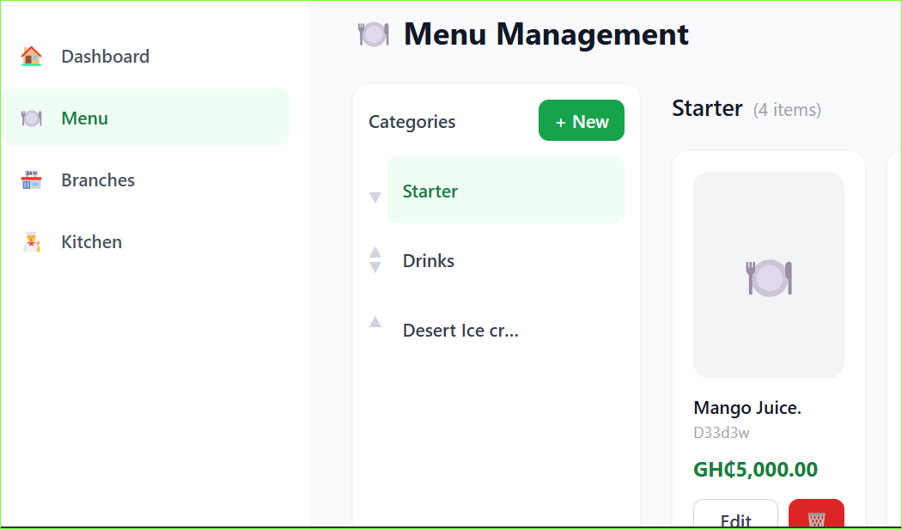
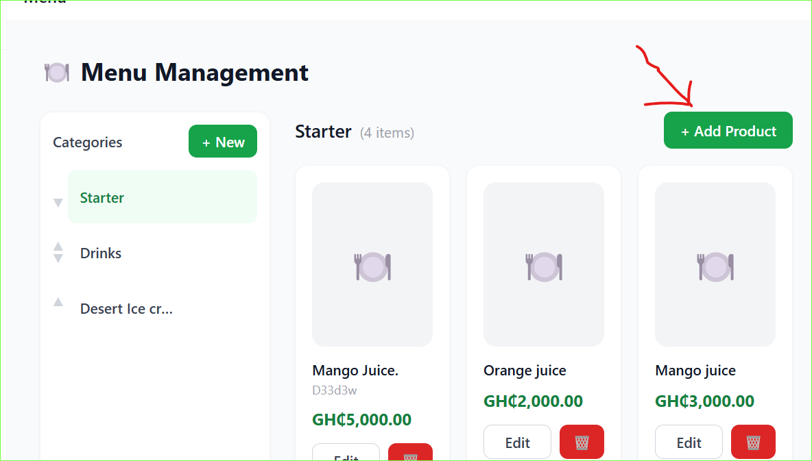

# Menu Management

Manage your restaurant menu from one place. Changes reflect on the customer menu immediately.

## Categories

Categories group your menu items (e.g. Starters, Mains, Drinks).

### Add a category

1. Go to **Menu Management** in the sidebar
2. Click **Add Category**
3. Enter the category name
4. Click **Save**

### Reorder categories

Drag and drop categories to change the order they appear on the customer menu.

---

## Products

Products are the individual items on your menu.

### Add a product

1. Open a category
2. Click **Add Product**
3. Fill in:
   - **Name** — required
   - **Description** — optional but recommended
   - **Price** — base price in GH₵
   - **Image** — optional (webp, jpg or png, max 5MB)
4. Click **Save**

### Edit a product

Click on any product to edit its name, description, price or image.

### Delete a product

Click the delete icon on a product. This removes it from all branches.

> If a product has been ordered before, deletion may be restricted to protect order history.

---

## Prices

The price you set here is the **base price** — it applies across all branches by default.

You can set a different price for a specific branch in [Inventory](/inventory).