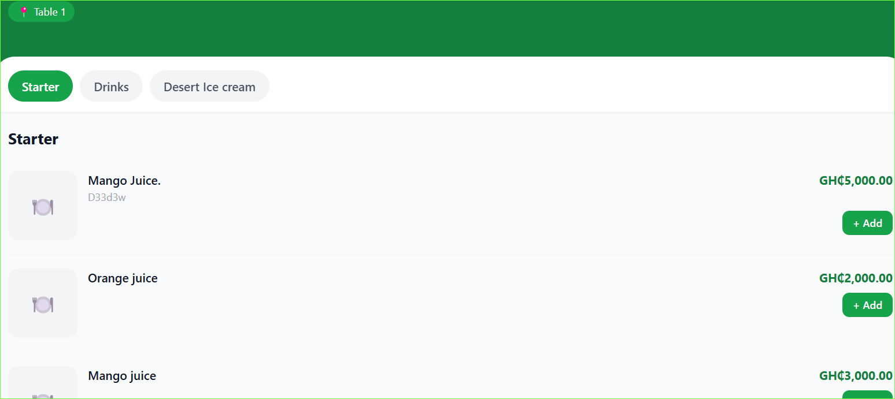
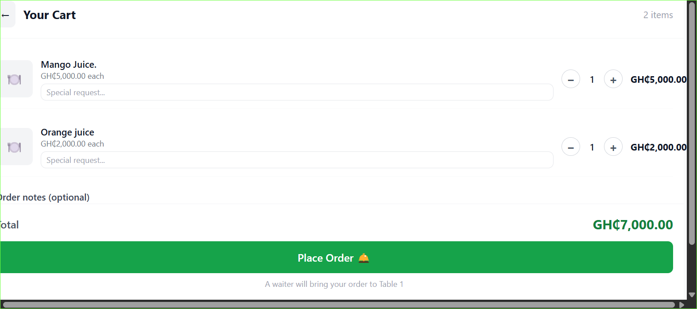

# QR Code Ordering

Customers order food by scanning a QR code at their table. No app download, no account, no friction.

## How it works

1. Customer sits at a table
2. Customer scans the QR code on the table with their phone camera
3. Your menu opens in their browser automatically
4. Customer browses categories and adds items to their cart
5. Customer taps **Place Order**
6. Order appears instantly on the Kitchen Board

---

## What the customer sees

- Your restaurant name and branch name at the top
- Menu organised by category
- Each item shows name, description, price and image
- A cart that updates as they add items
- A notes field for special requests (e.g. no pepper)

---

## QR codes

Each table has its own unique QR code. The QR code is tied to:
- The specific table (e.g. Table 3)
- The specific branch

If you regenerate a QR code the old one stops working immediately.

---

## Notes

- Customers do not need to create an account
- Orders go directly to the kitchen — no staff involvement needed at this step
- Multiple customers at the same table can place separate orders
- Items marked as unavailable do not appear on the menu