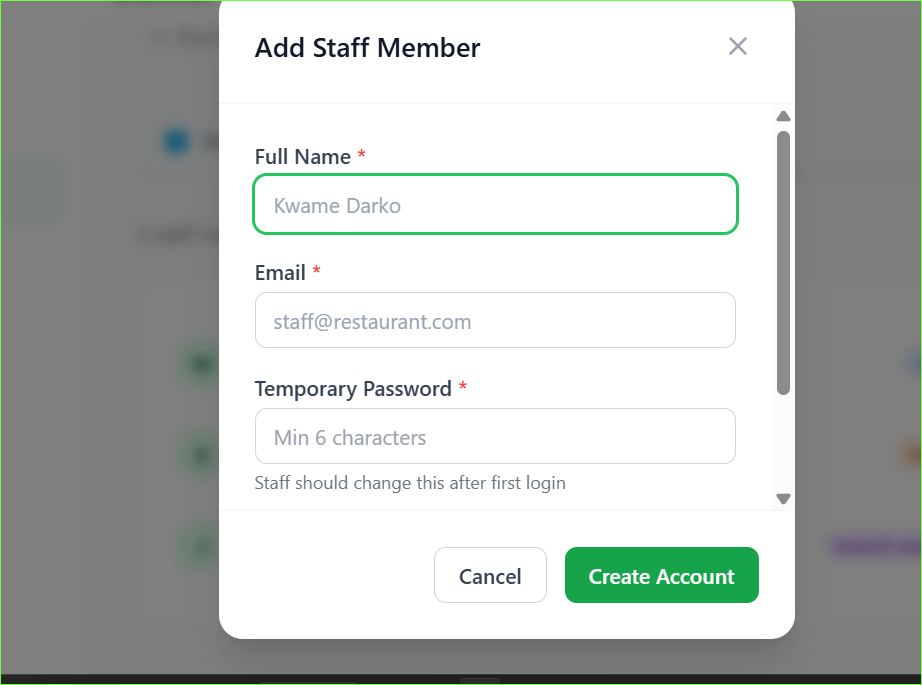

# Staff Management

Create accounts for your team and control what each person can access.

## Roles

### Organisation level

| Role | What they can do |
|---|---|
| **Super Admin** | Everything — billing, branches, all staff |
| **Manager** | Menu, categories, products, inventory, kitchen and waiter staff |
| **Staff** | Only their assigned branches |

### Branch level

| Role | What they can do |
|---|---|
| **Branch Manager** | Manages their branch, adds tables |
| **Kitchen** | Views orders only |
| **Waiter** | Marks orders as served |

---

## Add a staff member

1. Go to **Branches** and open the branch
2. Click the **Staff** tab
3. Click **Add Staff**
4. Fill in:
   - **Full name**
   - **Email address**
   - **Password** (minimum 6 characters)
   - **Branch role** (kitchen, waiter or branch manager)
5. Click **Create**

> Staff are automatically assigned to the branch you add them from.

---

## Remove a staff member

1. On the Staff tab find the staff member
2. Click **Remove**
3. Confirm

Their account is deactivated and they can no longer log in.

---

## What staff see when they log in

- **Kitchen staff** → Kitchen board only
- **Waiters** → Kitchen board with served button
- **Branch managers** → Their branch detail page
- **Managers** → Menu management and all branches
- **Super admin** → Full dashboard including billing